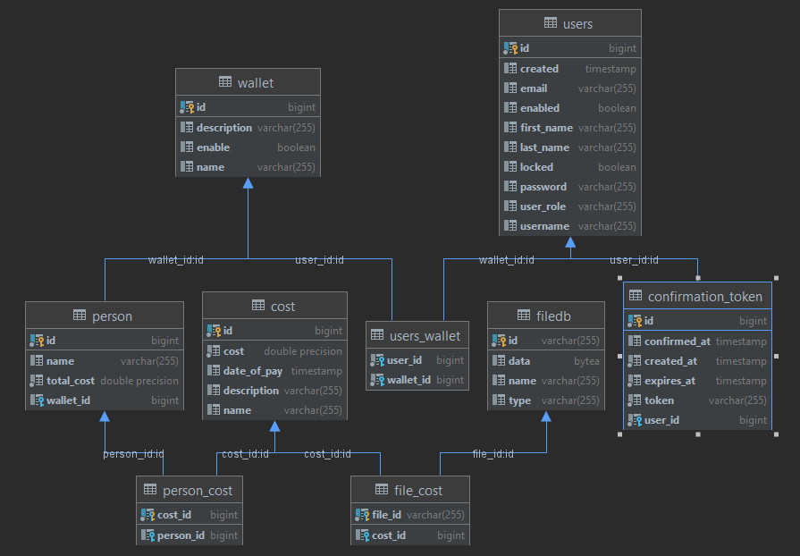

# Event Wallet - Backend

Event Wallet is a web application. It was made for classes in "Projekt Inżynierskiego". 

This application helps in settling accounts between friends. We enter our costs and the application calculates how much people in the wallet are owed. 

Link to Frontend: https://github.com/DawidLachor/EventWalletFrontEnd

## Technologies
* Java
* Spring Boot
* PostgreSQL
* JWT

## Database schema

